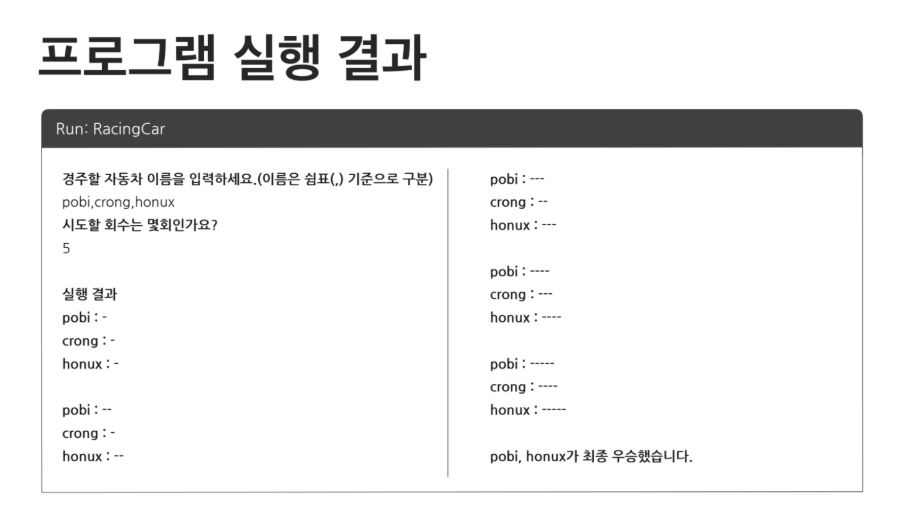

# java-racingCar 자동차경주 게임 저장소
## 기능 요구사항
+ 주어진 횟수 동안 n대의 자동차는 전진 또는 멈출 수 있다.
+ 각 자동차에 이름을 부여할 수 있다. 전진하는 자동차를 출력할 때 자동차 이름을 같이 출력한다.
+ 자동차 이름은 쉼표(,)를 기준으로 구분하며 이름은 5자 이하만 가능하다.
+ 사용자는 몇 번의 이동을 할 것인지를 입력할 수 있어야 한다.
+ 전진하는 조건은 0에서 9사이에서 random 값을 구한 후 random 값이 4이상일 경우 전진하고, 3 이하의 값이면 멈춘다.
+ 자동차 경주 게임을 완료한 후 누가 우승했는지를 알려준다. 우승자는 한 명 이상일 수 있다.

## 구현해야할 기능 목록
+ InputView
  + 자동차 이름 입력 받기
  + 시도 회수 받기
+ Model - RacingGame
  + randome number 생성하여 이동하는 로직 구현.
  + 각 객체에 이동로직 적용.
+ OutputView
  + 자동차들의 현재 이동거리를 출력
  + RacingGame의 결과를 받아서 전체 결과를 출력
+ Validator
  + 사용자 입력 검증
